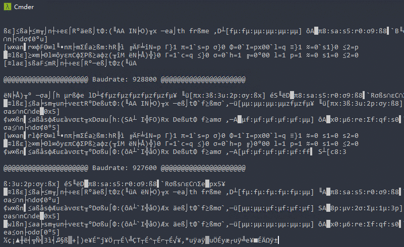

# baudrate

## Usage

```
Baudrate v1.1
Craig Heffner, http://www.devttys0.com

Usage: baudrate.py [OPTIONS]

        -p <serial port>       Specify the serial port to use [/dev/ttyUSB0]
        -t <millisecond>       Set the timeout period used when switching baudrates in auto detect mode [1]
        -c <num>               Set the minimum ASCII character threshold used during auto detect mode [25]
        -n <name>              Save the resulting serial configuration as <name> and automatically invoke minicom (implies -a)
        -a                     Enable auto detect mode
        -b                     Display supported baud rates and exit
        -q                     Do not display data read from the serial port
        -h                     Display help
```

### Auto Detect On Linux

```bash
sudo python2 baudrate.py -a -t 200
```

### Auto Detect On Windows

```
python2 baudrate.py -a -t 200 -p COM1
```

